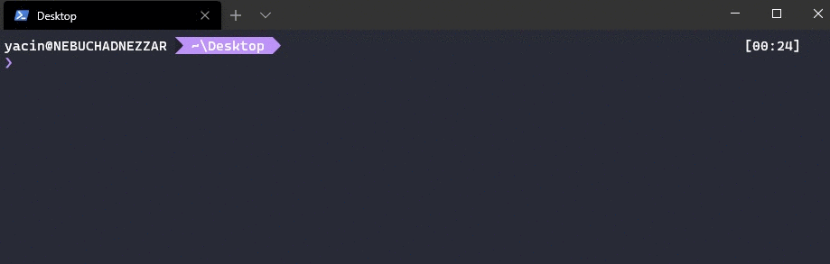
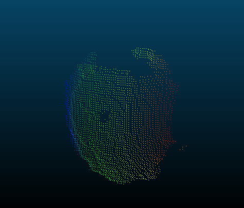

# PointCloudDescriptors

***A simple command line program to generate relevant descriptors from point cloud data (.PCD files) before exporting the results into Numpy Files (.NPY files) used with python.***

---

## Table of Contents

- [Installation](#installation)
- [Built With](#built-with)
- [Basic Usage](#basic-usage)
- [Features](#features)
- [Contributing](#contributing)
- [References](#references)
- [License](#license)

---

## Installation

> **Important** : *there is no need for installation.*

In order to use it, you must follow these steps:

1. Download the latest release from `https://github.com/yyaddaden/PointCloudDescriptors/releases`,
2. Extract the binary file,
3. Open the command line prompt,
4. Use it with the instructions below (see [Basic Usage](#basic-usage)).

## Built With

This project is built using these technologies:

- Programming Language: **C++**
- Libraries: 
  - **PCL** (Point Cloud Library) *with all the dependicies*: https://pointcloudlibrary.github.io/
  - **CNPY**: https://github.com/rogersce/cnpy
- Integrated Development Environment: **Microsoft Visual Studio 2019 Community x64**

## Basic Usage

In order to use the program, four different parameters must be provided:

1. The descriptors to extract:
  - **1**: *Signature of Histograms of Orientations* **SHOT** [1],
  - **2**: *RGB Signature of Histograms of Orientations* **SHOT RGB** [1],
  - **3**: *Unique Shape Context* **USC** [2].
  
2. The input .pcd file (point cloud data),
3. The output .npy file (numpy file),
4. The search radius (normals and descriptor parameter).

Below a demonstration:

> **Optional parameter:** *The fifth parameter allow to perform downsampling to reduce the number of points.*

The `apple.pcd` file used for the demonstration can be found under the folder `resources`.

It is provided from the **RGB-D Object Dataset**: https://rgbd-dataset.cs.washington.edu/dataset/rgbd-dataset_pcd_ascii/ 

Below the display of `apple.pcd` file in the program **CloudCompare**:

## Features

This command line program (*PointCloudDescriptor*) includes several features:

1. Feature generation by selecting one of the provided descriptors (see the list above),
2. Export to a format (Numpy File or .NPY) commonly used in Python,
3. Perform downsampling to reduce the complexity of the point cloud (optional fifth parameter).

## Contributing

> In order to contribue to this projet, there are two options :

- **Option 1** : 🍴 Fork this repo!
- **Option 2** : 👯 Clone this repo to your local machine using `https://github.com/yyaddaden/PointCloudDescriptors.git`

## References

**[1]** `Salti, S., Tombari, F., & Di Stefano, L. (2014). SHOT: Unique signatures of histograms for surface and texture description. Computer Vision and Image Understanding, 125, 251-264.`

**[2]** `Tombari, F., Salti, S., & Di Stefano, L. (2010, October). Unique shape context for 3D data description. In Proceedings of the ACM workshop on 3D object retrieval (pp. 57-62).`

## License

